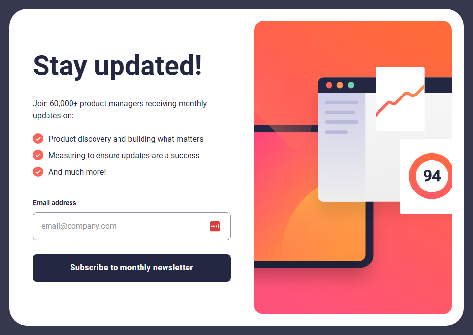

# Frontend Mentor - Newsletter sign-up form with success message solution

This is a solution to the [Newsletter sign-up form with success message challenge on Frontend Mentor](https://www.frontendmentor.io/challenges/newsletter-signup-form-with-success-message-3FC1AZbNrv). Frontend Mentor challenges help you improve your coding skills by building realistic projects. 

### Screenshot

### Links

- [Solution](https://www.frontendmentor.io/solutions/newsletter-sign-up-with-success-message-l_qnkCyz9Z)
- [Live Site](https://zxjklp.github.io/newsletter-sign-up-with-success-message-main/)

### Built With

- Semantic HTML5 markup
- CSS custom properties
- Flexbox
- CSS Grid
- Mobile-first workflow

## Author

- Frontend Mentor - [@Zxjklp](https://www.frontendmentor.io/profile/Zxjklp)
- GitHub - [@Zxjklp](https://github.com/Zxjklp)
